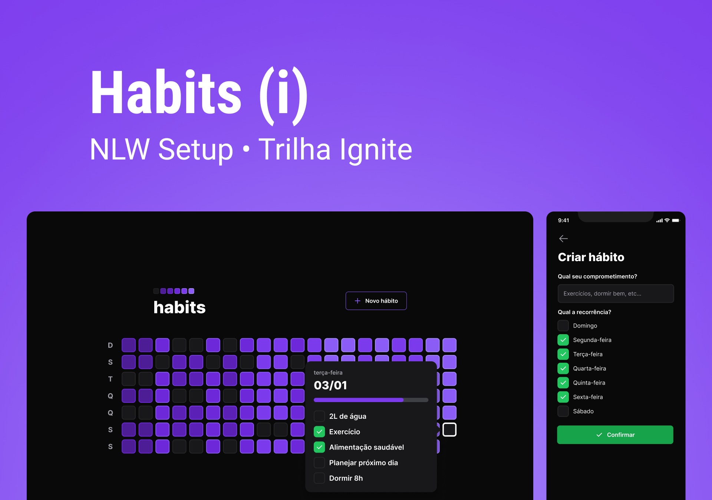

<h1>
  🚀NLW SETUP - Trilha Ignite🚀
</h1>

<p>
  Projeto desenvolvido durante o evento NLW Setup da trilha ignite, promovido pela Rocketseat.
</p>
<br>

<h2>
  👩‍💻 Tecnologias
</h2>
<p>
  Tecnologias utilizadas no desenvolvimento do projeto:
</p>


<p> - Front-end:</p>

   
   
   
   
   
  - Dayjs, Axios, Radix UI, React Query
  
<p>Back-end:</p>

   
   
   
   
  
  - Dayjs, Axios
  
   

<p>Mobile:</p>

  
  
  
  

- React Navigation, React Reanimated

   
<br>
<h2>
  📱 Projeto
</h2>
<p>
  O Projeto consiste em uma aplicação para controle de hábitos diários, onde o usuário pode adicionar novos hábitos para completar com o passar do tempo.

Aplicação completa com back-end, front-end e mobile.

</p>


<br>
<br>

## 🐑 Clonando projeto

```bash
# Clone e acesse a pasta
$ git clone https://github.com/LuanContreiras/nlw-setup-ignite 
$ cd nlw-setup-ignite


# Back-end - Instalando as dependências
$ cd server
$ npm i
# Inicie o servidor
$ npm run dev


# Front-end - Instalando as dependências
$ cd web
$ npm i
# Abra em seu localhost
$ npm run dev


# Mobile - Instalando as dependências
$ cd mobile
$ npm i
# Abra em seu localhost
$ npm start
```


